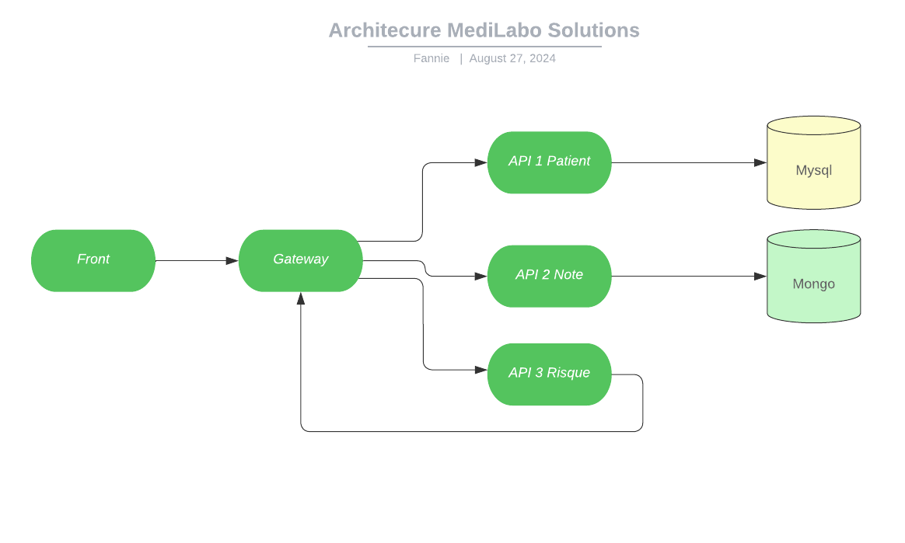

# p9_medi_labo_solutions

## Prérequis
- Git
- Docker
- MongoDB Compass
- DBeaver

## Installation

### Cloner le dépôt sur votre machine :
```bash
git clone https://github.com/Fannie87/p9_medi_labo_solutions.git
cd p9_medi_labo_solutions
docker compose up
```

### Connexion à l'application

Se connecter à l'url suivante avec les identifiants user/password

[http://localhost:8080/front-medilabo/login](http://localhost:8080/front-medilabo/login)

### Recommandations green code
- Une seule base de données SQL en deux tables
- Pas de système organisé en micro-service, mais en une seule application
- API3-Risque fait ses appels directement aux bases de données, sans passer par API1 Patient et API2 Note

### Schéma Architecure MediLabo Solutions



